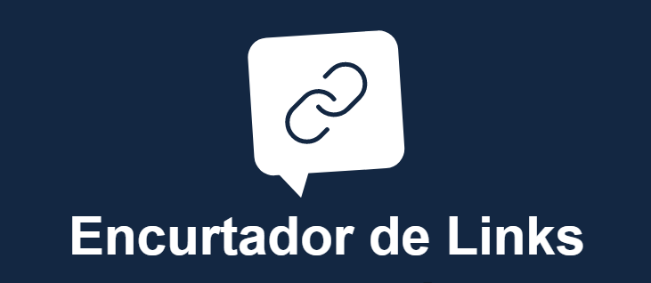
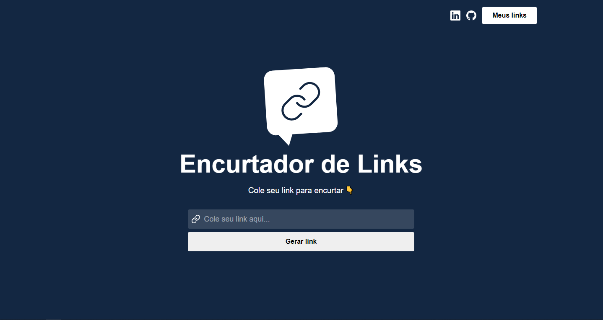
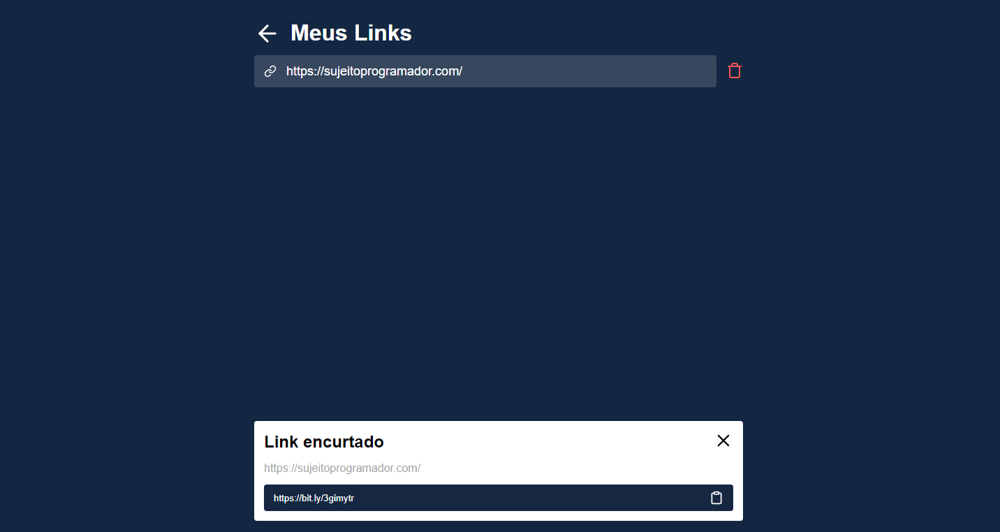
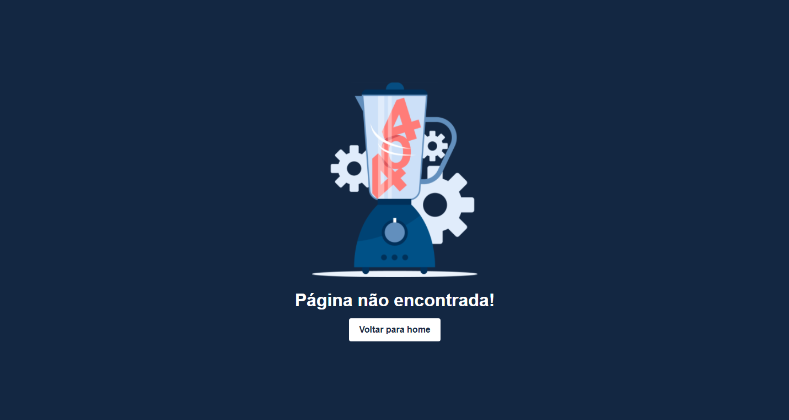

<h1 align="center">
    
</h1>

<p align="center">
  <a href="#-projeto">Projeto</a>&nbsp;&nbsp;&nbsp;|&nbsp;&nbsp;&nbsp;
  <a href="#-tecnologias">Tecnologias</a>&nbsp;&nbsp;&nbsp;|&nbsp;&nbsp;&nbsp;
  <a href="#-executar aplicação">Executar Aplicação</a>&nbsp;&nbsp;&nbsp;|&nbsp;&nbsp;&nbsp;
  <a href="#-licença">Licença</a>
</p>

<p align="center">
 

  
</p>
<br>

## 💻 Projeto

O projeto consiste em um sistema para encurtar links (URLs).<br>

Neste projeto foi utilizado a api da Bitly para realizar o encurtamento das URLs e o armazenamento foi persistido offline em Local Storage.

Encurtar links é uma prática muito utilizada nos dias de hoje, principalmente por profissionais de social media. <br>

Além de ter um efeito visual bem bacana, evitando que URLs muito extensas poluam o espaço da publicação, a medida traz outros benefícios para a estratégia de marketing digital. 💜

## Acessar o domínio do projeto

- [Encurtar links](https://encurtar-links-wat.netlify.app/)

<br>

## Prévia vizualização do sistema

Demonstração do sistema

<p align="center">
    
</p>

Página Home

<p align="center">
    
</p>

Página Meus Links

<p align="center">
    
</p>

Página 404

<p align="center">
    
</p>

### Para asistir ao video acesse:

- [Encurtador de Links](https://youtu.be/tq04zSB1ncs)

<BR>

## 🚀 Tecnologias

Esse projeto foi desenvolvido com as seguintes tecnologias:

- [Node.js](https://nodejs.org/en/)
- [React.js](https://reactjs.org/)
- [Javascript](https://developer.mozilla.org/pt-BR/docs/Web/JavaScript/Guide/Introduction)
- [HTML5](https://developer.mozilla.org/pt-BR/docs/Web/HTML/HTML5)
- [CSS3](https://www.tutorialspoint.com/css/css3_tutorial.htm)
- [Figma](https://www.figma.com/)
- [Bitly](https://bitly.com/)

### Design do projeto

[Figma](https://bit.ly/35QZEHG)

<br>

## Executar Aplicação

## 🔥 Executando Localmente a Aplicação

Caso você deseja executar o projeto na sua máquina local, você precisará instalar o Node.js em sua máquima, após a instalação, basta seguir os passos abaixo:

### 🌀 Começando...

Para começar, você deve simplesmente clonar o repositório do projeto na sua máquina e instalar as dependências.

#### ❗️ Instalando as Dependências (via Windows):

Abre o cmd (caso esteja utilizando o Windows) navegue até o local onde você clonou o projeto, exemplo:

```sh
C:\Users\NomeDoComputador\Documents\clonedoprojeto
```

Depois, quando estiver na pasta do projeto, basta acessar o projeto na pasta `encurtador-link` digitar no cmd a seguinte instrução: **(dentro da pasta `encurtador-link` do projeto clonado)**

```sh
npm install
```

Ao digitar a instrução acima, automaticamente ele irá baixar todas as dependências listadas e definidas no arquivo package.json:

- `node_modules` - que contêm os packages do npm que precisará para o projeto.

#### 💨 Executando a Aplicação

Bom, agora **(dentro da pasta `encurtador-link` do projeto clonado)** abra um terminal para o projeto ser executado e digite:

```sh
npm start
```

Pronto! dessa forma o projeto estará rodando localmente em sua maquina, acesse:

```sh
http://localhost:3000
```

<br>

### 🚩 Tenho Dúvidas... O que fazer?

Caso tenham dúvidas sobre o código do projeto, sintam-se a vontade em abrir uma **[ISSUE AQUI](https://github.com/Wanderson-A-Timoteo/encurtador-link/issues)**. Assim que possível, estarei respondendo as todas as dúvidas que tiverem!

## Licença

Esse projeto está sob a licença MIT. Veja o arquivo [LICENSE](LICENSE.md) para mais detalhes.

## Autor:

Feito com ♥ by

- [**Wanderson A. Timóteo**](https://wanderson.tk)

## Agradecimentos:

<h1 align="center">
    
</h1>

- Projeto desenvolvido durante a Semana [Semana React JS](https://sujeitoprogramador.com).
<h1 align="center">
    
</h1>

- Agradecimento a [Matheus Fraga](linkedin.com/in/matheus-fraga-6940679a) por compartilhar seu conhecimento.
